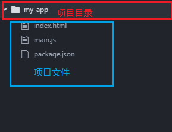
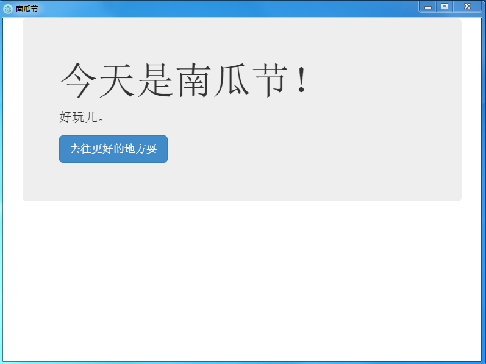

### electron 入门教程
* 环境依赖(自行安装)
    1. ) node.js  
    2. ) npm
* 一、安装 electron.js
  ```
  终端输入：
    npm install -g electron-prebuilt（墙内有问题请自行切换至`淘宝源`）
  ```
* 二、新建项目（基本包含 3 个文件）
    1. ) package.json
    2. ) index.html
    3. ) main.js
<<<<<<< HEAD
    * 图示 
=======
       * 
>>>>>>> 9ba33bda9a53a6c604a86cc3ed538b1cd7cb158d
* 文件基本内容
    1. ) package.json 内容、关注点在 `main` 该配置文件为引导文件
    ```
    {
      "name": "my-app",
      "version": "1.0.0",
      "description": "",
      "main": "main.js",
      "scripts": {
        "test": "echo \"Error: no test specified\" && exit 1"
      },
      "author": "zhangxianglin",
      "license": "MIT"
    }
    ```
    2. ) index.html 内容安装 html 格式来写即可(具体不再展示)
    3. ) main.js 内容是核心
    ```
// 载入electron模块
const electron=require("electron");
// 创建应用程序对象
const app=electron.app;
// 创建一个浏览器窗口，主要用来加载HTML页面
const BrowserWindow=electron.BrowserWindow;

// 声明一个BrowserWindow对象实例
let mainWindow;

// 定义一个创建浏览器窗口的方法
function createWindow(){
    // 创建一个浏览器窗口对象，并指定窗口的大小
    mainWindow=new BrowserWindow({
        width:800,
        height:600
    });

    // 通过浏览器窗口对象加载index.html文件，同时也是可以加载一个互联网地址的
    mainWindow.loadURL('file://'+__dirname+'/index.html');
    // 同时也可以简化成：mainWindow.loadURL('./index.html');

    // 监听浏览器窗口对象是否关闭，关闭之后直接将mainWindow指向空引用，也就是回收对象内存空间
    mainWindow.on("closed",function(){
        mainWindow = null;
    });
}

// 监听应用程序对象是否初始化完成，初始化完成之后即可创建浏览器窗口
app.on("ready",createWindow);

// 监听应用程序对象中的所有浏览器窗口对象是否全部被关闭，如果全部被关闭，则退出整个应用程序。该
app.on("window-all-closed",function(){
    // 判断当前操作系统是否是window系统，因为这个事件只作用在window系统中
    if(process.platform!="darwin"){
        // 退出整个应用程序
        app.quit();
    }
});

// 监听应用程序图标被通过点或者没有任何浏览器窗口显示在桌面上，那我们应该重新创建并打开浏览器窗口，避免Mac OS X系统回收或者销毁浏览器窗口
app.on("activate",function(){
    if(mainWindow===null){
        createWindow();
    }
});

    ```
* 三、打包
  1. ) 安装打包工具
    ```
    终端输入
    npm install -g asar
    ```
  2. ) 命令行切换至项目
    ```
    终端输入
    asar pack 项目 你要的名字.asar
    ```
  3. ) 终端的目录下找到 `你要的名字.asar`
* 四、运行
  1. ) 在文件目录搜索 `npm`
    ```
    找到路径
    C:\Users\这里是你的电脑名称\AppData\Roaming\npm\node_modules\electron-prebuilt\dist\resources\
    ```
  2. ) 把 `你要的名字.asar` 文件复制一份到上一步找到的目录中
  3. ) 找到如下路径后执行 `electron.exe`
    ```
    找到路径
    C:\Users\这里是你的电脑名称\AppData\Roaming\npm\node_modules\electron-prebuilt\dist\
    ```
<<<<<<< HEAD
  * 五、大功告成
    * 
=======
* 五、大功告成
     * 
>>>>>>> 9ba33bda9a53a6c604a86cc3ed538b1cd7cb158d
* 尾声
   * 其中 `dist` 可复制到其他地方运行 `electron.exe` 重命名、可更换图标
   
   ---
 #### 参考教程
 * https://www.kancloud.cn/winu/electron/154345
 * https://electronjs.org/
